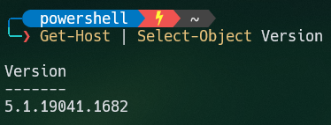

# My PowerShell custom setup using Windows Terminal

PowerShell version used while configuration:\


Links:\
:arrow_forward: [PowerLine in PowerShell](https://docs.microsoft.com/en-us/windows/terminal/custom-terminal-gallery/powerline-in-powershell)\
:arrow_forward: [Prompt Setup](https://docs.microsoft.com/en-us/windows/terminal/tutorials/custom-prompt-setup)\
:arrow_forward: [Oh-My-Posh](https://github.com/JanDeDobbeleer/oh-my-posh)\
:arrow_forward: [Terminal Icons](https://github.com/devblackops/Terminal-Icons)\
:arrow_forward: [Nerd Fonts](https://github.com/ryanoasis/nerd-fonts)\
:arrow_forward: [Nerd Fonts Download](https://www.nerdfonts.com/font-downloads)

Windows Terminal custom theme:
- Acryllic 50%
- Hack Nerd Font
- Background color: #001B26
- All in new duplicated and modified **One Half Dark** theme


# Before Installation

Before performing any module installation i prefer to create new user profile with environment attribute like following:
```
$env:USERPROFILE\.config\powershell\user_profile.ps1
```
Commands for default powershell user profile filepath:\
``
$profile
``
or
``
$PROFILE.CurrentUserCurrentHost
``

which should be located (as default) in path like:\
``
C:\Users\USERNAME\Documents\WindowsPowerShell\Microsoft.PowerShell_profile.ps1
``


# Installation

**1. Scoop**
```
iwr -useb get.scoop.sh | iex
```
**2. Git**
```
winget install -e --id Git.Git
```
**3. Curl**
```
scoop install curl sudo jq 
```
**4. NeoVim**
```
scoop install neovim gcc
```
**5. Fuzzy Finder**
```
scoop install fzf
```
**6. Node Version Manager**
```
scoop install nvm
```
with v. 14.16.0 for NVM
```
nvm install 14.16.0
```
**7. z - Directory Jumper**
```
Install-Module -Name z -Force
```
or
```
Install-Module -Name z -AllowClobber
```
**8. PowerShell Read Line**
```
Install-Module -Name PSReadLine -Scope CurrentUser -Force -SkipPublisherCheck
```
with v. 2.1.0 for PSReadLine
```
Install-Module PSReadLine -RequiredVersion 2.1.0
```
**9. Fuzzy Finder for PowerShell**
```
Install-Module -Name PSFzf -Scope CurrentUser -Force
```
**10. Posh-Git**
```
Install-Module posh-git -Scope CurrentUser -Force
```
**11. Oh-My-Posh**
```
Install-Module oh-my-posh -Scope CurrentUser -Force
```
To check list of all available **Oh-My-Posh** themes type ``Get-PoshThemes``\
To set chosen theme ``Set-PoshPrompt -Theme THEME_NAME`` (remember to include this as prompt within userprofile config file)

**12. Terminal-Icons**
```
Install-Module -Name Terminal-Icons -Repository PSGallery -Force
```
or with scoop
```
scoop bucket add extras
```
```
scoop install terminal-icons
```
**13. JanDeDobbeleer.OhMyPosh**
```
winget install JanDeDobbeleer.OhMyPosh
```


# User profile prompts

```
# ===== Prompt =====
Import-Module posh-git
Import-Module oh-my-posh
Import-Module -Name Terminal-Icons
Set-PoshPrompt THEME_NAME
function Get-ScriptDirectory { Split-Path $MyInvocation.ScriptName }
$PROMPT_CONFIG = Join-Path (Get-ScriptDirectory) 'THEME_NAME.omp.json'
oh-my-posh -init --shell pwsh --config $PROMPT_CONFIG | Invoke-Expression
nvm use 14.16.0

# ===== PSReadLine =====
Set-PSReadLineOption -PredictionSource History
Set-PSReadLineOption -PredictionViewStyle ListView
Set-PSReadLineOption -EditMode Emacs
Set-PSReadLineOption -BellStyle None
Set-PSReadLineKeyHandler -Chord 'Ctrl+d' -Function DeleteChar

# ===== Fzf =====
Import-Module PSFzf
Set-PsFzfOption -PSReadlineChordProvider 'Ctrl+f' -PSReadlineChordReverseHistory 'Ctrl+r'

# ===== Utilities =====
function which ($command) {
	Get-Command -Name $command -ErrorAction SilentlyContinue | Select-Object -ExpandProperty Path -ErrorAction SilentlyContinue
}
```
Configure according to your preferences :)
